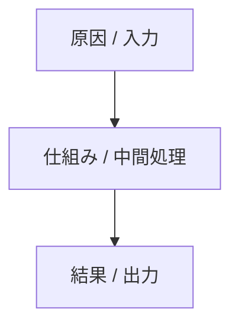

> [!tip] 要点
> <1-2 行で結論を先出し。読者が冒頭で「何の話か」「なぜ重要か」を掴めること>

## 事象

<具体的に何が起きたか。固有名詞は使わず、別案件でも読める表現にする (固有名詞があれば project/ へ)>

## なぜそうなるか

<仕組み・原因。箇条書きで分解>

- <仕組み 1>
- <仕組み 2>
- <仕組み 3>

<!-- 因果やフローを含む場合は mermaid 図を必ず入れる -->

> [!warning] 構造的制約 (該当する場合)
> <避けようがない構造的傾向や前提条件を強調する>

## 具体例

<!-- 最低 2 領域を含める。元会話ドメイン + 日常領域 / 抽象例 -->

| 場面 | 起きる現象 |
|---|---|
| <領域 A の例> | <現象> |
| <領域 B の例> | <現象> |

## 適用

<どう使うか / どう運用するか>

- <適用 1>
- <適用 2>
- <適用 3>

## 関連

- [[<関連ノート名>]] — <なぜ関連するか一言>
