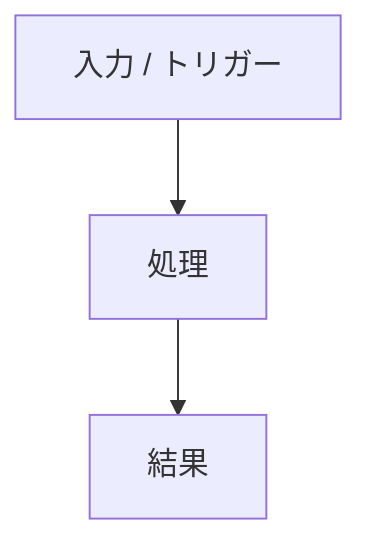

> [!tip] 何をするもの / 何の話か
> <1-2 行で「この知見が解決すること」を先出し>

## 場所

- 実装: `<ファイルパス>`
- 関連: `<ファイルパス>`

## 仕組み / 設計

<どう動くか・なぜそう設計したか>

<!-- 因果やフローを含む場合は mermaid 図を必ず入れる -->

## 落とし穴 / 注意点

- <この project 固有の罠 1>
- <罠 2>

> [!warning] よくある誤解
> <チームで起きやすい誤解や、過去ハマったポイント>

## 適用

<この知見を使う時の手順 / 判断基準>

## 関連

- [[<関連ノート名>]] — <なぜ関連するか>

戻る: [[<project hub 名>]]
